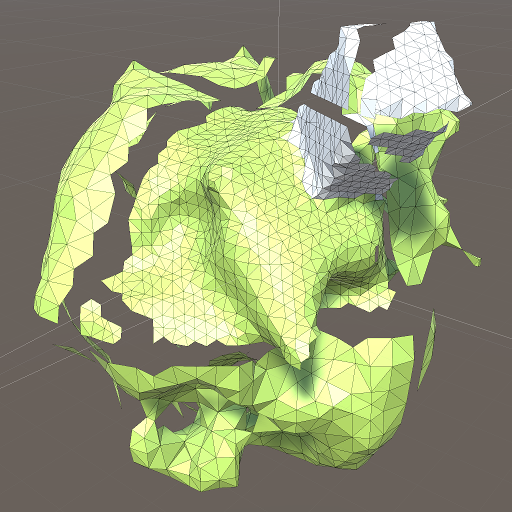

# Terrain chunks with gaps

Behold a small, green planet with a tall, white building in the Unity game engine. We divide the terrain of the planet into chunks, where each chunk has a mesh generated by applying a dual contouring algorithm to a signed distance field. The terrain chunks are organized in an octree, where they will subdivide and reunite based on viewing distance. The next step will be to stitch together the terrain chunks at the seams, filling those ugly gaps.

