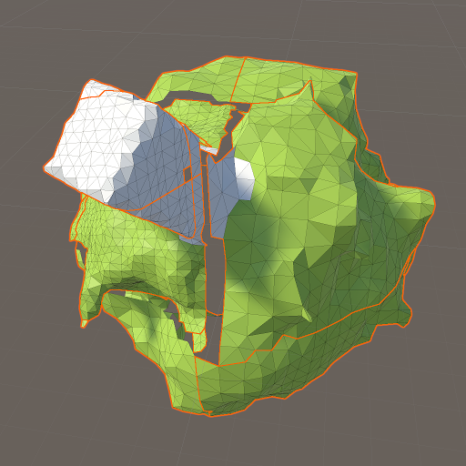

# Stitched faces between equal-sized neighbor chunks

After much confusion and some trial-and-error, I managed to stitch together equal-sized neighbor chunks along their faces. Selective debug drawing in Unity, along with some mostly unrelated doodles in Gimp, helped me track down and fix multiple bugs. The small, green planet with a tall, white building already looks a lot better:

Left to do:

1. Stitch equal-sized chunks along edges (four chunks per seam)
2. Stitch mixed-sized chunks along faces (two chunks per seam)
3. Stitch mixed-sized chunks along edges (three or four chunks per seam)

Steps 1 and 2 shouldn't be too hard, but I dread taking step 3 with my current approach, which involves duplicating a lot of code per axis. There will be many different cases when stitching smaller chunks together with larger ones.
