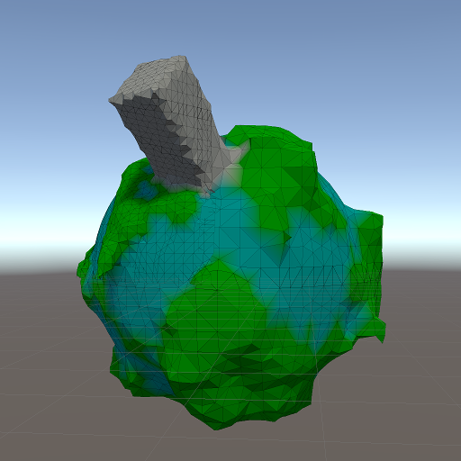

# Simplified mesh generation

The initial code for generating chunk meshes was unwieldy.
It wasn't that complex,
but I had still painted myself into a corner by sampling the distance field in a fixed grid.
When I started thinking about how to stitch smaller chunks to larger ones,
the fixed grid started feeling like a sticky web.

So I threw out most of the code and implemented something more brute force.
I also threw out submeshes,
and having multiple terrain materials.
Mixing vertex colors is more flexible,
but I suspect that I will need to provide more material data than a diffuse color.
The new code doesn't do proper stitching yet.

