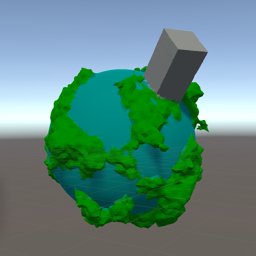

# Ported nickgildea/qef to C#

When using the Dual Contouring algorithm,
you have a choice of where in the cell to place the vertex.
You can even place the vertex outside of the cell,
but I believe doing that can result in self-intersections.

The QEF (Quadratic Error Function) approach attempts to minimize the sum of squared distances to the edge intersection planes.
It can generate sharp corners,
but requires some tuning to avoid spiky geometry.
I have made yet another [port](https://github.com/elemel/qef-csharp) of
[Nick Gildea's QEF implementation](https://github.com/nickgildea/qef) to C# for use in Unity.
The [Dual Contouring Tutorial](https://www.boristhebrave.com/2018/04/15/dual-contouring-tutorial/)
by Boris the Brave was very helpful for understanding how to tune the QEF output.
