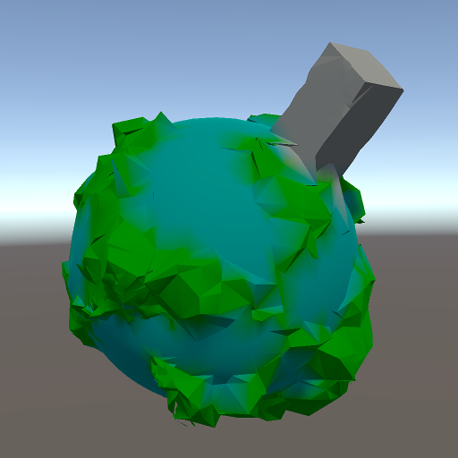

# Blending face normals and vertex normals

During the last few days,
I have tried to improve the look of the output mesh by using the normals from the distance field.
The previous images all displayed normals recalculated by Unity.
These would be face normals since the Dual Contouring implementation generates separate vertices for each triangle.
When I started providing normals myself,
some of the smaller triangles ended up black.
The problem was that Unity's vector class explicitly but unexpectedly normalizes small vectors to zero.
That kind of behaviour should never be normalized.

Now wielding artisanal, non-zero normals, I carried on with my experiments. In the end, I settled for

- the vertex normal from the distance field when it's within 15 degrees of the face normal,
- the face normal when the difference is above 30 degrees,
- and a smooth blend of both in between.

Another problem that cropped up here was that Unity's smoothstep function doesn't do what I was going for.
I was starting to sense a pattern of unreasonable expectations from my side.
Luckily, these things are usually sorted out quickly once identified.
And the approach finally did indeed yield output meshes with both smooth and sharp features,
with a visual artifact of faceted features where more sampling is required.
And that's the price we pay.

