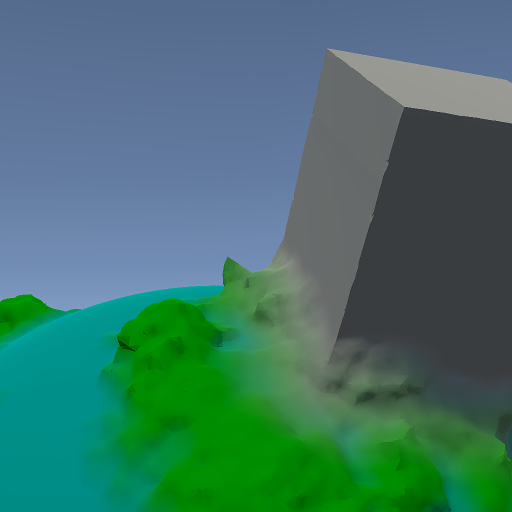

# Blending colors and shapes



The smooth-min function can blend smoothly between two shapes.
There are several variants of smooth-min.
I'm using one that I believe was popularized by Alex Evans of demoscene and Media Molecule fame.
The upcoming Dreams game looks amazing, by the way.

```csharp
public static float SmoothMin(float distance1, float distance2, float radius)
{
    float h = Mathf.Max(radius - Mathf.Abs(distance1 - distance2), 0.0f);
    return Mathf.Min(distance1, distance2) - h * h * 0.25f / radius;
}
```

There's a lot of resources online about sampling distance fields,
but not as much about materials and shading.
My current approach is to return a diffuse color as part of the distance sample.
The material data can be extended later on,
perhaps with a simplified specular or emissive parameter.
For blending the color smoothly, I came up with this:

```csharp
public struct DistanceSample
{
    public float distance;
    public Color color;

    public DistanceSample(float distance, Color color)
    {
        this.distance = distance;
        this.color = color;
    }
}

public DistanceSample SmoothMin(DistanceSample sample1, DistanceSample sample2, float radius)
{
    float distance = SmoothMin(sample1.distance, sample2.distance, radius);
    float t = SmoothStep(-radius, radius, sample1.distance - sample2.distance);
    Color color = Color.Lerp(sample1.color, sample2.color, t);
    return new DistanceSample(distance, color);
}

public float SmoothStep(float x1, float x2, float x)
{
    x = Mathf.Clamp((x - x1) / (x2 - x1), 0.0f, 1.0f);
    return x * x * (3.0f - 2.0f * x);
}
```
