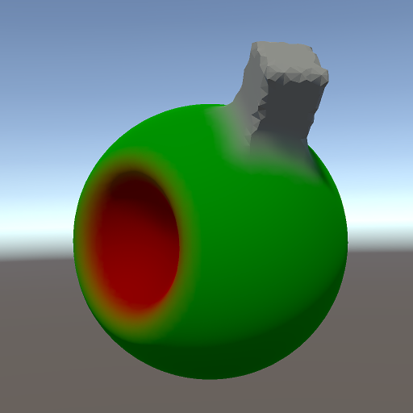

# The olive out of space



During the last week,
I learned one or two things about compute shaders.
Porting the Dual Contouring code to HLSL improved performance by orders of magnitude.

There is some room for improvement in Unity's support for compute shaders in macOS.
The most annoying thing is that compilation errors do not surface in the editor.
Instead, you can find them on disk right here:

```<project>/Library/shadercompiler-UnityShaderCompiler*.log```

The logs aren't cleared between compilations either.
New error messages can easily be lost among the great old ones.
Another, also most annoying thing was that for-loops were incredibly slow to compile in macOS Sierra (Metal),
and in many cases failed to compile at all.
The editor hangs with a spinning beach ball during shader compilation,
making the long compilation times even more disturbing.
Thankfully, the compute shader support is a lot better in High Sierra (Metal 2).
