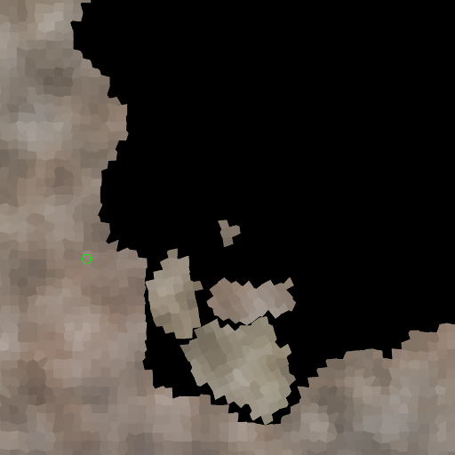

# Rafterlife

Rafterlife is a cave flyer that I've been hacking on for a few weeks now. The
setting is a procedurally generated miniature planet. Everything in the game is
grid-based; including the player's ship (a.k.a. raft), which you can customize
by adding or removing blocks.

Since regular grids have an annoyingly blocky look and feel, I'm
generating the blocks as a Voronoi diagram seeded by a square jitter.
See the blog post
[Jittered grid vs Poisson disc](https://www.redblobgames.com/x/1830-jittered-grid/)
by Amit Patel for an interactive illustration. The seed points are constrained
to the central 25% of each square (50% of the x-axis multiplied by 50% of the
y-axis), so that each resulting polygon will have at most eight neighbors. The
polygons can then be used directly in Box2D.
