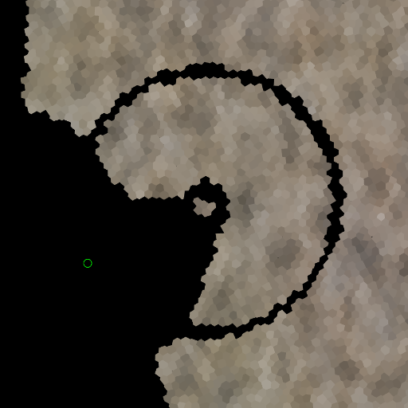

# Switching to hex grids in Rafterlife

I've sort of decided to use (and halfway implemented the use of) hex grids
instead of square grids for everything in Rafterlife. The main reasons for
switching are:

1. The planet in the game will be a single grid, and the hex grid has less
   directional aliasing as the world turns.
2. The hex grid has more uniform neighbor relationships: six edge neighbors in
   the hex grid vs. four edge and four vertex (diagonal) neighbors in the square
   grid.
3. Most mining and crafting games that I've seen use a square grid. I want to
   try something different.

Changing enough of the code to generate terrain and get something interactive
but incomplete went quicker than expected. The hex grid is backed by a
rectangular grid where only half of the cells are used, forming a checkerboard
pattern. Amit Patel calls this
[doubled coordinates](https://www.redblobgames.com/grids/hexagons/#coordinates-doubled).
Since Lua tables are naturally sparse, I don't bother remapping the indices to
something contiguous. One follow-up change that seems appealing is to switch
the index order from `grid[x][y]` to `grid[y][x]`, so that less Lua tables are
required for the
[pointy-topped](https://www.redblobgames.com/grids/hexagons/#basics) hex grid.
