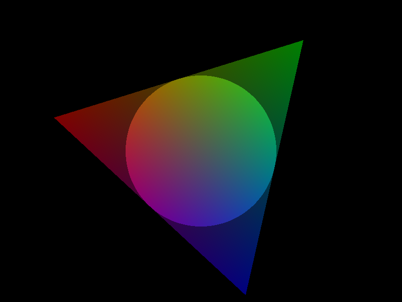

# We are all in the gutter

In real-time computer graphics,
surface splatting is a more recent alternative to the venerable triangle mesh.
The usual implementation draws points that are converted to quads in a geometry shader.
Points are well suited to represent discs,
avoiding some duplication of attribute data compared to triangles or quads.
But since I usually hack in LÖVE,
which as of version 11.3 lacks support for geometry shaders,
points are off the table.
In [Gutter](https://github.com/elemel/gutter),
I will at least initially use triangles.
They are simpler and more compact than quads,
while admittedly being more wasteful in terms of discarded pixels.

