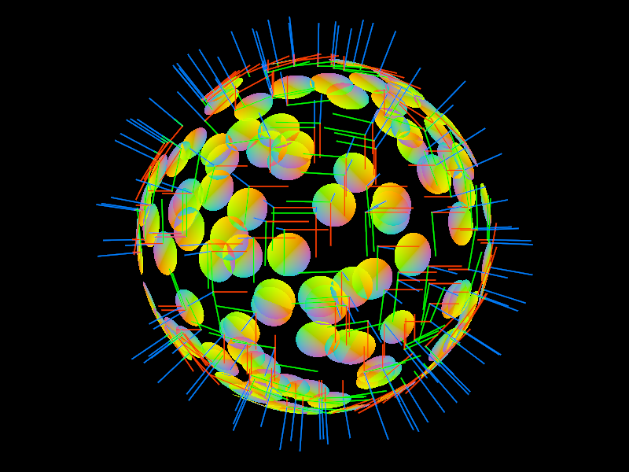

# Quad pro quo

In response to my [previous post](/2020/07/03),
a [wizard](https://www.breakin.se/) told me that geometry shaders aren't as widespread or efficient as I thought.
He also told me that quads are most efficiently drawn with indexed triangle pairs.
I took his advice to heart and changed how [Gutter](https://github.com/elemel/gutter) draws surface disks.

Making these changes,
I struggled to understand the tangent-space coordinate system,
as well as LÖVE's depth projection.
Solving graphics problems is both easy and hard.
Hard because of ghe GPU mystery box,
and the sheer volume of data processed each frame.
Easy due to the obviously visual nature of it all.
Generally speaking,
debug-stepping and debug-printing are inefficient tools,
while debug-drawing is a powerful one.
Fight fire with fire.
The inefficiency of debug-stepping and debug-printing is related to complexity and data volume.
These tools gain power as you narrow down to a minimal reproduction of the problem.
Some problems can be solved through trial and error,
e.g. negating the direction of a vector,
or swapping the order of two triangle vertices.
I still have some figuring out left to do,
but get by with a little help from my friends.
