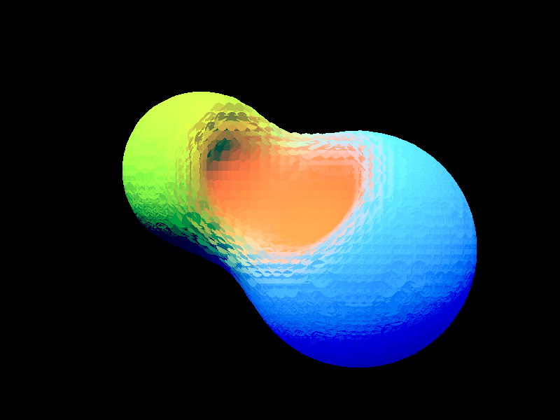
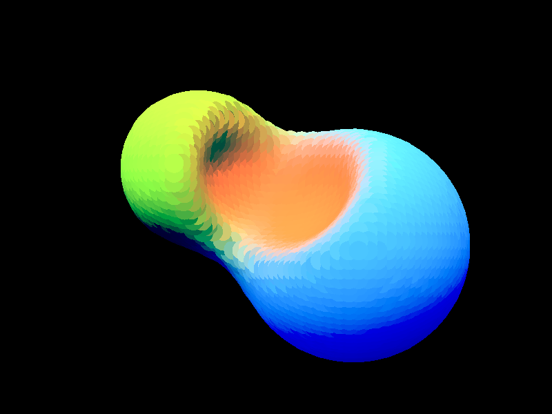

# Surface splatting of constructive solid geometry

I spent the last few days on continued exploration of surface splatting in [Gutter](https://github.com/elemel/gutter).
My top priority after the [previous post](/2020/07/04) was replacing the hardcoded sphere with data-driven geometry.
The geometry is now represented as a flat edit list of [CSG](https://en.wikipedia.org/wiki/Constructive_solid_geometry) operations,
as described in [*Learning from Failure*](https://www.mediamolecule.com/blog/article/siggraph_2015) by Alex Evans.
I returned to a reference on [distance functions](https://www.iquilezles.org/www/articles/distfunctions/distfunctions.htm) by Inigo Quilez to sort out the details.
The edit list supports the smooth union and subtraction operations,
along with the lonely sphere primitive. Smooth color blending is also supported, recycled from my Unity solution from [a couple of years ago](https://github.com/elemel/blog/tree/master/2018/09/04).
Extending the edits with more operations and primitives should be straightforward.

## Grid sampling

When converting the CSG model to surface disks for drawing,
the first step is to sample distances and colors in a 3D grid.
The initial implementation of the grid sampling traversed the grid,
applying the entire edit list to each vertex before proceeding to the next vertex.
Gradients for surface normals introduced additional sampling.
The current implementation instead traverses the edit list,
applying each edit to the entire grid before proceeding to the next edit.
Gradients are now derived from the sample grid,
avoiding additional sampling.

Benchmark of initial implementation:

```
Converted model to mesh in 7.494 seconds.
```

Current benchmark:

```
Initialized 128x128x128 grid in 0.652 seconds
Appled 3 edits in 1.568 seconds
Generated 14621 points in 0.984 seconds
Created mesh in 0.049 seconds
Total: Converted model to mesh in 3.253 seconds
```

The current implementation is more than twice as fast compared to the initial one.

## Stacking the plates



As visible above,
intersections between the surface disks resulted in a pattern reminiscent of golf balls.
The dents were ironed out by flattening the z-coordinate across each disk in the vertex shader,
as visible below.


