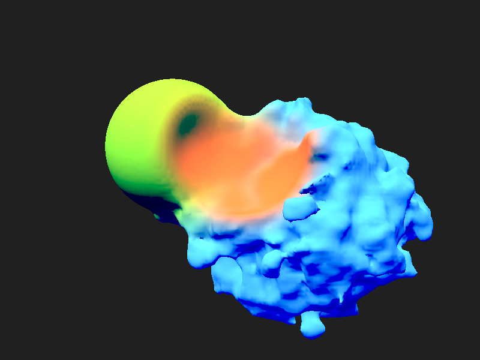

# Dual contouring reconstructed

As an alternative to [surface splatting](/2020/07/08),
[Gutter](https://github.com/elemel/gutter) can now generate a regular triangle mesh using dual contouring.
I might go back to the [Dual Contouring Tutorial](https://www.boristhebrave.com/2018/04/15/dual-contouring-tutorial/) by Boris the Brave to figure out how to implement [QEF](/2018/08/31) vertex placement in Lua.
For now,
Gutter has a simplified vertex placement based on the distance samples of the grid vertices.
The grid vertices are first classified as inside or outside based on their distance signs.
The cell vertex is then placed using the mean position and mean distance of each group.

