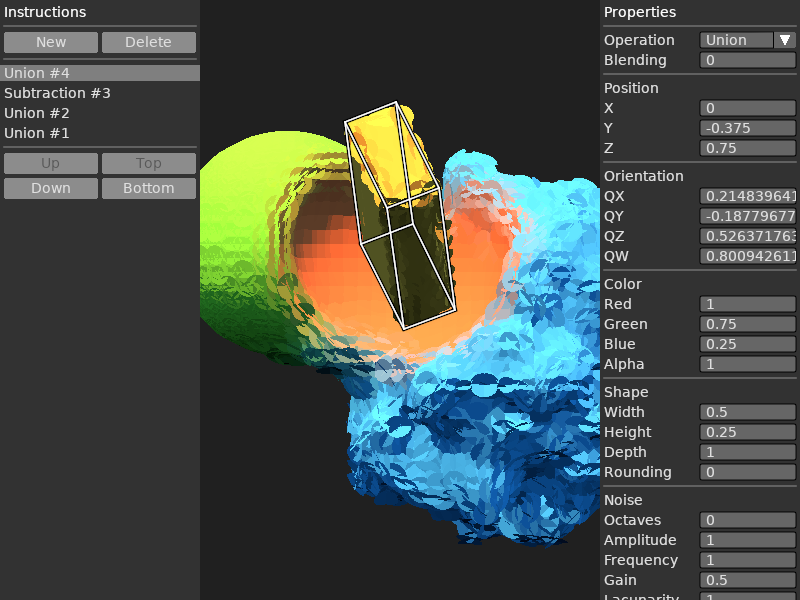

# Editor mode

During the last couple of weeks,
I've been working on an editor mode for [Gutter](https://github.com/elemel/gutter).
The initial hardcoded GUI broke down immediately,
and I started researching widget toolkits for LÖVE.
In particular,
I was interested to learn more about [immediate mode GUIs](https://en.wikipedia.org/wiki/Immediate_mode_GUI).

After browsing the [GUI libraries on the LÖVE wiki](https://love2d.org/wiki/Graphical_User_Interface),
I implemented a minimal GUI based on [LÖVE-Nuklear](https://github.com/keharriso/love-nuklear),
listing the instructions (a.k.a. edits) of the model (a.k.a. sculpture),
along with the properties of the currently selected instruction.
The main drawback with this solution was a binary dependency on [Nuklear](https://github.com/Immediate-Mode-UI/Nuklear).
I also experienced multiple layout crashes, and wasn't interested in investigating them further.

Then I stumbled upon [Slab](https://github.com/coding-jackalope/Slab),
which is a GUI toolkit for LÖVE in pure Lua.
I rewrote the Nuklear GUI to use Slab instead.
Now I'm working on adding more editing capabilities,
e.g. moving and rotating instructions in the editor viewport using the trackpad (a.k.a. mouse).

