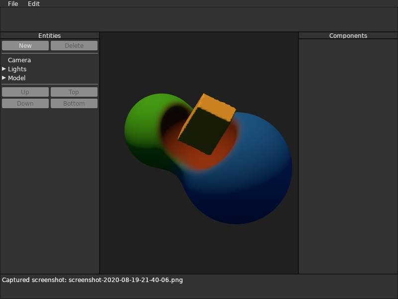
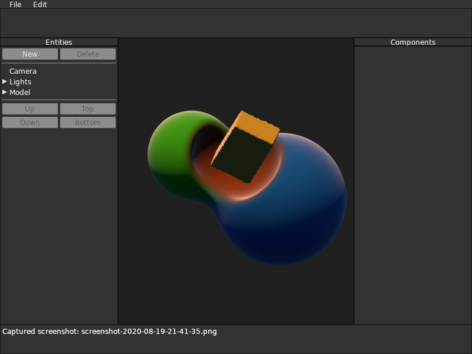

# The Fresnel effect

The shaders in [Gutter](https://github.com/elemel/gutter) have received a silver lining in the form of a Fresnel effect.
The Fresnel effect mirrors a [real-world phenomenon](https://en.wikipedia.org/wiki/Fresnel_equations),
where surfaces become more reflective as the view direction approaches the surface tangent.

At least [one tutorial for Unity](https://www.ronja-tutorials.com/2018/05/26/fresnel.html) and [another for Unreal Engine](https://docs.unrealengine.com/en-US/Engine/Rendering/Materials/HowTo/Fresnel/index.html) recommended treating the Fresnel result as emissive,
which felt wrong in the physically-based sense.
Instead,
Gutter fades the surface to white when approaching the grazing direction.
I expect to revisit the Fresnel effect when introducing glossy and metallic material channels.

Without the Fresnel effect:

With the Fresnel effect:

