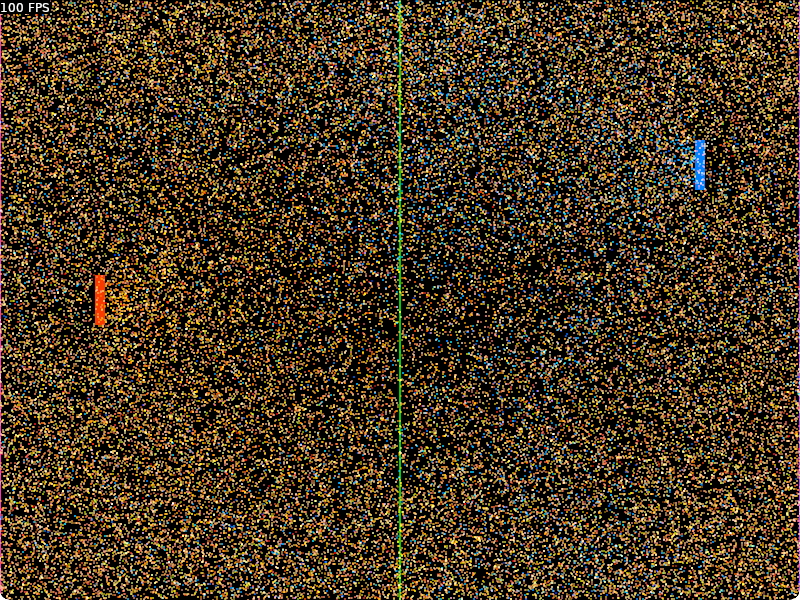

# Tabula rasa

I recently went back to hacking on [Tabula](https://github.com/elemel/tabula),
my game engine of yesteryear.
Tabula follows the [entity-component-system](https://en.wikipedia.org/wiki/Entity_component_system) (ECS) design,
which is an example of [data-oriented design](https://en.wikipedia.org/wiki/Data-oriented_design).
An ECS engine has much in common with a database engine,
and less in common with the object-oriented programs that most of us are used to most of the time.

In Tabula,
an entity is simply an integer ID,
while a component is simply a string identifier.
Components can be typed or untyped.
Untyped components refer to regular Lua values, such as strings or tables.
Typed components are associated with data types.
The data types are C types,
typically primitives or structs.
Typed component values are stored in C arrays,
enabling efficient use of the [CPU cache](https://en.wikipedia.org/wiki/CPU_cache).

An entity can have multiple components attached to it,
along with the values of the components.
The entity itself is in fact also a component, with the ID as value.
The components and values attached to an entity form a row.

Tabula is an archetype-based ECS engine.
An archetype is identified by a unique set of components.
Archetypes are formatted as filesystem paths.
Entities with the same archetype are stored in the same tablet.
A tablet is similar to a database table,
but  `table` was already taken in Lua.
Tablets are further split into shards that contain the actual row data.
During the lifetime of a row,
components can be added or removed,
changing the archetype of the row.
Whenever the archetype of a row changes,
the row moves to the tablet of the new archetype.

Here's some log output from running the Scoreline example:

```
Adding tablet for archetype: /box/color/entity/paddleTag/position
Adding shard #1 for archetype: /box/color/entity/paddleTag/position
[...]
Generating row-traversal code for arity 3
```

Scoreline started as a clone of Pong,
but I ended up adding 65,536 balls as a performance test of Tabula.


